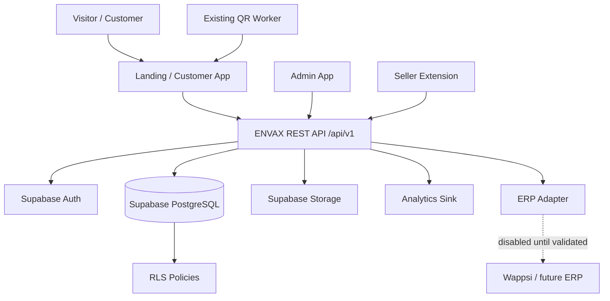
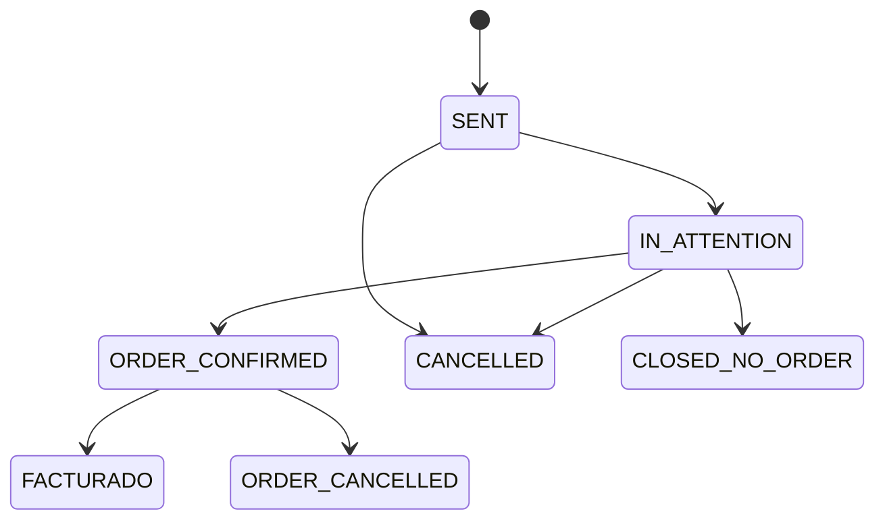

# ENVAX — Architecture V1

## 1. Architectural style

Use a **modular monolith** around Supabase.

Do not start with microservices, Kubernetes, a separate Node server or a second operational database.

## 2. Logical view

Customer/admin apps and the extension never receive privileged database/service-role credentials.

## 3. Deployable components

### Current landing

Preserve the existing production landing/QR behavior until a dedicated migration proves staging parity and rollback.

### `apps/customer`

One customer application for:
- public catalog;
- search/filter/product exploration;
- local anonymous convenience state if implemented;
- authenticated persistent lists;
- formal request flow;
- `Mis pedidos` and order detail/status;
- eligible promotions.

Private capabilities appear after authentication inside the same ENVAX experience.

### `apps/admin`

Internal administration and operations:
- catalog management;
- customer/commercial supervision;
- requests/orders;
- promotions;
- internal member management;
- configuration;
- analytics/audit views.

Administrator has full V1 authority; sensitive actions remain audited.

### Supabase Edge Function API

Use one logical versioned REST API, recommended path:

`supabase/functions/api-v1/`

Internal modules:
- catalog;
- customers;
- lists;
- requests;
- orders;
- promotions;
- seller;
- admin;
- analytics;
- audit;
- extension;
- integrations.

### `extensions/seller`

Internal browser extension using the normal authenticated seller context. It does not receive Supabase service-role keys or permanent ERP credentials.

### Existing QR Worker

Keep the current QR Worker isolated until any migration has regression evidence.

## 4. Supabase platform responsibilities

### Auth

V1 login is email + password.

Roles at application level:
- `CUSTOMER`;
- `SELLER`;
- `ADMIN`.

V1 has exactly one seller.

### PostgreSQL

Operational source of truth for:
- user/customer profiles;
- catalog metadata;
- persistent favorite lists;
- requests and snapshots;
- orders and snapshots;
- promotions;
- audit records;
- idempotency records;
- optional first-party analytics events if retained locally.

Every schema change is a versioned migration committed to Git.

### Row Level Security

RLS is mandatory for private customer data and any table directly exposed through Supabase data APIs.

At minimum:
- Customer A cannot read/write Customer B resources;
- customers cannot change commercial states;
- seller receives only commercial permissions;
- admin receives authorized V1 management access;
- audit history is not editable by customers.

### Storage

Supabase Storage holds public catalog photos/media.

Baseline:
- public read only for approved catalog media;
- uploads/changes restricted to admin/server-authorized flows;
- no invoices, secrets or fiscal documents in public storage.

## 5. Identity model

### Anonymous visitor

Anonymous visitor:
- can browse the public catalog;
- may use local browser favorites if the frontend offers them;
- does not get a persisted ENVAX business account/profile automatically;
- cannot access persistent lists, private promotions, formal requests or orders.

### Authenticated customer

Supabase Auth account enables persistence.

Minimal ENVAX business profile:
- business name;
- contact name;
- email;
- business type/segment.

No anonymous-account upgrade/merge architecture is required in V1.

## 6. Favorites domain

Persistent entities:
- favorite list;
- favorite list item.

Rules:
- authenticated customer only;
- one customer can own many named lists;
- list item references a concrete variant/presentation;
- no cart totals, tax, checkout or payment semantics;
- quantity belongs in request preparation, not favorites;
- deleting/deactivating a list never deletes prior commercial history.

## 7. Solicitud → pedido domain

Keep `requests` and `orders` distinct.

Rules:
- formal request requires authenticated customer;
- request items are historical snapshots;
- one V1 request creates zero or one order;
- request→order creation is transactional and idempotent;
- `FACTURADO` means seller/admin confirmed external invoicing succeeded;
- ENVAX has no invoice entity in V1.

## 8. Seller model

V1 has exactly one seller.

Therefore:
- no assignment table/policy is required for business routing;
- no territory/load-balancing/queue logic;
- customer does not choose seller.

Seller permissions:
- read required customer/commercial context;
- start attention;
- confirm order;
- cancel request/order;
- confirm `FACTURADO`;
- use extension;
- read necessary commercial history.

Seller cannot administer catalog, users/roles, promotions, system configuration or admin analytics.

## 9. Promotions

Admin creates/manages promotions.

Targeting may use:
- specific customers;
- business types/segments;
- related products/variants.

Promotion is commercial content/interest, not checkout or price engine.

## 10. API architecture

Use Supabase Edge Functions in TypeScript for `/api/v1`.

Prefer a small router inside one `api-v1` function for V1. Keep domain handlers/services separated by module.

API validates:
- session/JWT;
- role;
- ownership;
- payload schema;
- valid state transition;
- idempotency where needed.

Complex multi-write commercial transitions should be implemented atomically using PostgreSQL functions/RPC or another transaction-safe server-side mechanism.

## 11. Integration boundaries

Keep interfaces/adapters for:
- EmailProvider;
- WhatsApp handoff generation;
- ErpGateway;
- AnalyticsSink.

ERP adapter remains disabled/manual until Wappsi validation passes.

External failures must not corrupt ENVAX commercial state.

## 12. Failure rules

- API write endpoints return stable error codes.
- Commercial writes use idempotency where retries can duplicate effects.
- External provider failure cannot silently mark success.
- Ambiguous extension data cannot transition records.
- All state transitions are validated server-side.
- Analytics failure does not block catalog/commercial flow.

## 13. Non-functional goals

- simple enough for one maintainer;
- TypeScript end-to-end;
- reproducible local Supabase environment;
- migrations in Git;
- staging separate from production;
- no secrets in browser bundles;
- structured logs/request IDs;
- restore drill before production;
- independently deploy frontends/extension/QR without forcing business-data duplication.

## 14. Explicitly rejected legacy baseline

The previous construction plan used Cloudflare D1/R2 and persisted anonymous accounts. That baseline is superseded.

Do not build V1 operational data on D1/R2 and do not implement anonymous-account/recovery tables unless a new explicit decision replaces the current architecture.
