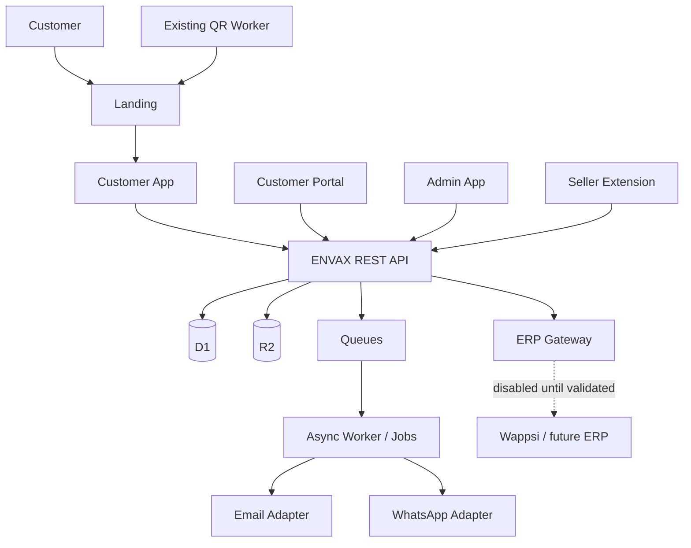
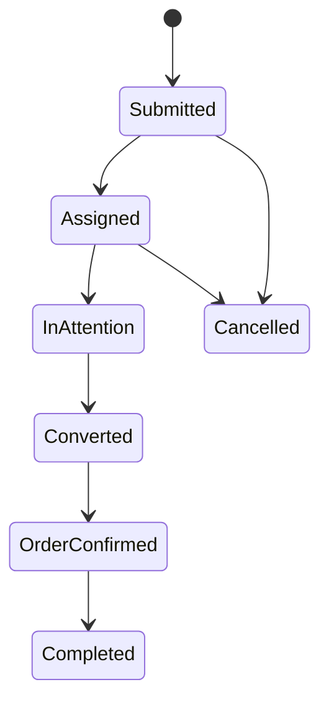

# ENVAX — Architecture V1

## 1. Architectural style

Use a **modular monolith at the application level**, deployed on Cloudflare as a small set of independently deployable components. This keeps one-maintainer operations simple while preserving module boundaries.

Do not start with microservices.

## 2. Logical view

The browser apps and extension never connect directly to D1/R2 with privileged credentials.

## 3. Deployable components

### `apps/landing`

Purpose: lightweight public entry point and QR destination.

Responsibilities:
- brand/contact landing;
- collect business name and business type when entering catalog;
- redirect/handoff into customer app;
- remain independently deployable.

It must not contain core business logic.

### `apps/customer`

One customer application that can render:
- catalog;
- anonymous mode;
- favorites;
- pedido request flow;
- later portal/order views;
- later promotions.

Do not create separate products called “catalog” and “portal”. Portal behavior is an authenticated mode of the same customer experience.

### `apps/admin`

Internal ENVAX operations:
- incoming solicitudes/pedidos;
- later customers;
- promotions;
- basic configuration/business types;
- operational audit views.

Protect internal access strongly. Prefer Cloudflare Access for the first internal deployment plus application RBAC where required.

### `services/api`

Single REST API for V1. Modules:
- Identity
- Business Types
- Catalog
- Favorites
- Order Requests
- Orders
- Seller Assignment
- Promotions
- Customer Portal
- Admin
- Notifications/Handoffs
- Audit
- Integrations

### `extensions/seller`

Internal browser extension. It only captures text explicitly selected by a seller and sends normalized/validated data through the API.

### `workers/qr`

Current QR Worker remains isolated. Migration from existing `qr-worker/` can happen after regression tests; no need to rename it before foundation is stable.

## 4. Storage

### D1

D1 is the V1 source of truth for ENVAX operational data:
- identities and sessions;
- business profiles/types;
- catalog normalized data imported from canonical source;
- favorite lists/items;
- solicitudes and pedidos;
- statuses and audit trail;
- promotion definitions/targets/interests;
- admin/seller configuration that is not secret.

Use migrations committed to Git. No production schema edits by hand.

### R2

R2 stores unstructured product/media assets. Asset metadata and visibility rules remain in D1.

Because public image visibility is not fully approved, use a policy layer:
- `public`: safe for direct/cached delivery;
- `customer`: visible only after an ENVAX customer/anonymous session is established;
- `internal`: admin/seller only.

Do not hard-code “all images public”.

### Queues

Do not put Queues in the critical path for basic reads. Use them for:
- outbound email/provider calls;
- promotion fan-out;
- retryable integration jobs;
- optional analytics/event batching;
- future ERP synchronization.

Consumers must be idempotent because queue delivery can repeat.

## 5. Identity model

### Anonymous account

When a customer enters with business name + business type:
1. API creates `anonymous_account`.
2. API creates a random server-side session.
3. Browser receives a Secure + HttpOnly + SameSite cookie.
4. ENVAX can optionally offer “Crear/guardar acceso anónimo”.
5. A random recovery credential is generated; store only its hash server-side.
6. On another device, user provides/scans the recovery credential to create a new session for the same anonymous account.

Never use IP address as customer identity.

### Portal upgrade

A verified customer account links to the existing anonymous account. Upgrade must preserve favorites and pedido history.

Portal contact verification is provider-adapter based. Do not promise WhatsApp OTP until a real provider/API is available.

## 6. Favorites domain

Entities:
- favorite list;
- favorite item.

Rules:
- one account may have many named lists;
- list names are customer-defined;
- no totals, taxes, checkout, payment or cart semantics;
- item references product/variant but remains independent of later requests;
- deleting a favorite list never deletes a previously submitted solicitud/pedido.

## 7. Solicitud → pedido domain

Keep `order_requests` and `orders` distinct.

Customer labels are derived, not stored as free text:
- Submitted / Assigned → `Solicitud enviada`
- InAttention → `En atención`
- Converted / OrderConfirmed → `Pedido confirmado`
- Completed → `Completado`

On request submission, snapshot the product lines used for the request. Future catalog edits must not rewrite historical requests.

When extension/ERP conversion succeeds:
- create/link one `order` from one `order_request`;
- mark request converted;
- update customer-visible state;
- write audit event;
- enforce idempotency so retry cannot create a second order.

## 8. Seller assignment

Assignment is a server-side policy.

V1 baseline:
- only active sellers are eligible;
- choose seller with the fewest open assignments;
- deterministic tie-break using stable rotation;
- if no seller is eligible, leave request `unassigned` and raise an operational flag.

Keep the policy behind an interface so business rules can change without changing request creation.

## 9. Promotions domain

Admin creates a promotion and targets:
- one specific customer; or
- one/more business types.

Promotion targeting is server-side. The customer app only displays promotions the API says are eligible.

Selecting promotions creates `promotion_interest` records and a handoff context; it does not create a purchase.

## 10. Integration boundaries

Define interfaces:

- `CatalogSource`
- `AssetStore`
- `EmailProvider`
- `WhatsAppProvider`
- `ErpGateway`
- `AnalyticsSink`
- `SellerAssignmentPolicy`

Business modules depend on interfaces, not vendors.

`ErpGateway` is disabled/mock-backed until Wappsi validation passes.

## 11. Failure rules

- API write endpoints return stable error codes.
- User-facing requests use idempotency keys.
- Async consumers deduplicate by event/job ID.
- External provider failure cannot silently mark work successful.
- Ambiguous extension extraction cannot transition a solicitud.
- All state transitions are validated server-side.

## 12. Non-functional goals

- simple enough for one maintainer;
- independently deployable components;
- responsive web first;
- accessible keyboard/touch interactions;
- no secret in browser bundles;
- structured logs and request IDs;
- staging separate from production data;
- database restore procedure tested before production gate;
- replace extension with ERP adapter later without changing customer-facing contracts.
